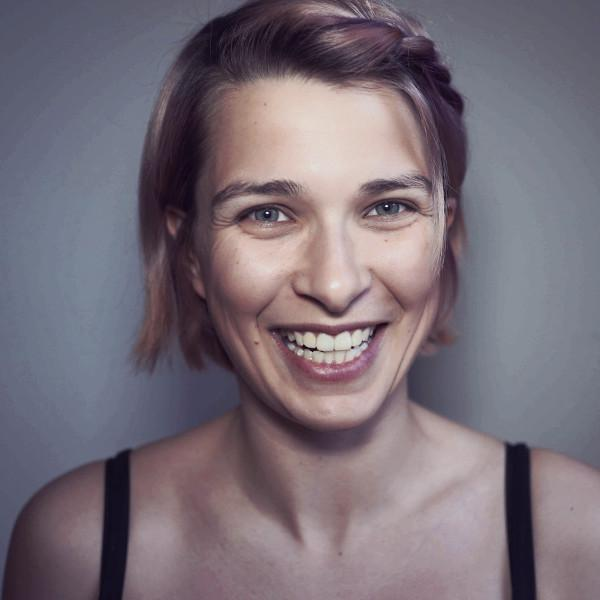
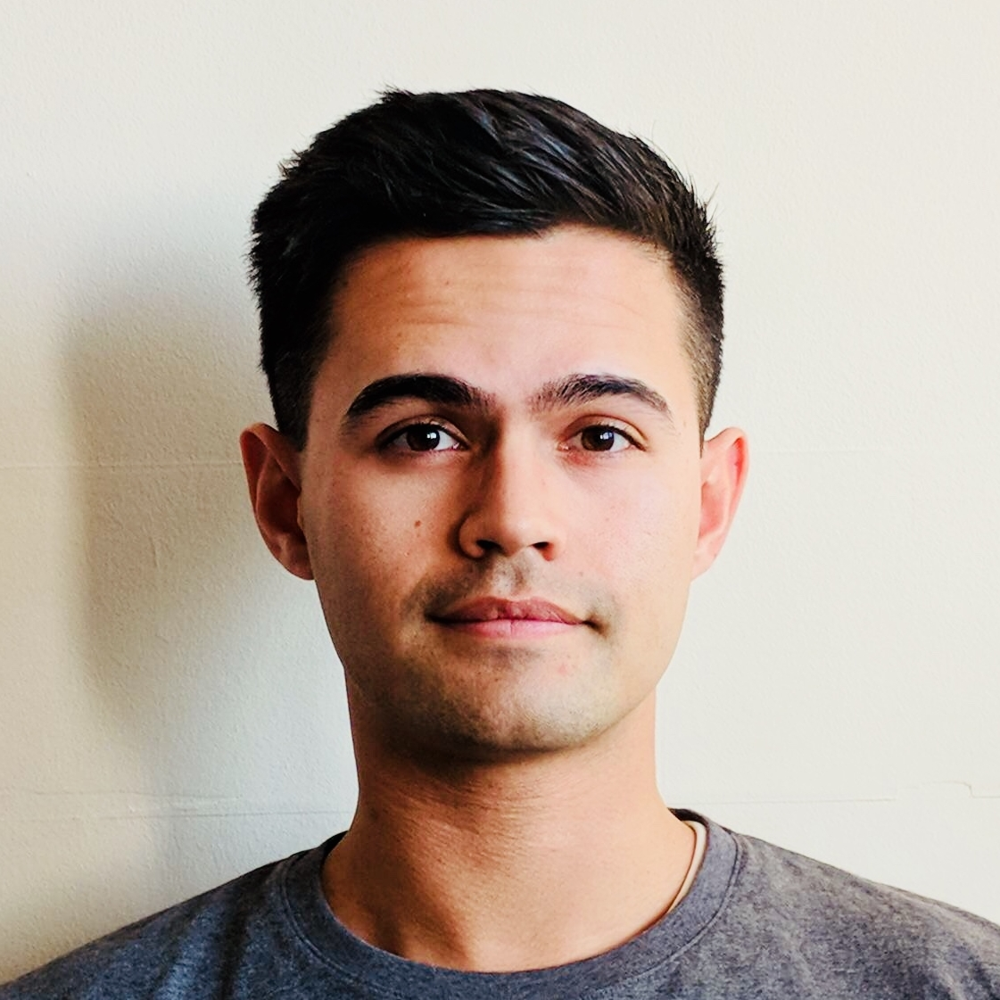
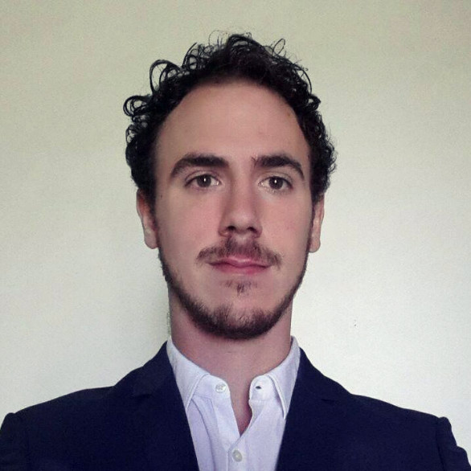
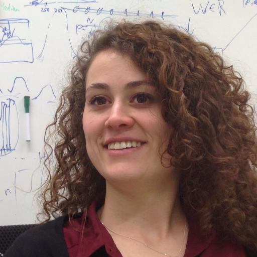
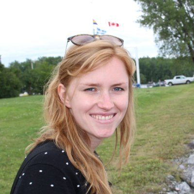

# Universiteit Van Amsterdam Inclusive AI

## Statement on UVA IAI

We are proud to announce that the UvA Instituut voor Informatica is opening a new Inclusive AI (IAI) community. The purpose of the IAI is to build a long-lasting community where members can connect with like-minded people of a similar background and help each other in an environment, where they may feel more at ease. 

We have taken inspiration from organisations such as Inclusion in ML, Black in AI, Women in ML, Queer in ML, and Latinx in ML, which all aim to celebrate diversity and foster participation from underrepresented groups in AI. The IAI establishes a similar such space for students of the KI Bachelor and AI Master at the UvA, focussing on:

- female students, 
- racial and ethnic minority students, 
- economically and academically disadvantaged students, 
- LGBTQ+ students, 
- students with disabilities.

## Mailing list

We created a [mailing list](https://groups.google.com/forum/#!forum/uva-iai) that you can join to stay uptodate with our activities.

## Mentorships

## List of mentors
### Maximilian Ilse

Lorem ipsum dolor sit amet, consectetur adipiscing elit, sed do eiusmod tempor incididunt ut labore et dolore magna aliqua. Ut enim ad minim veniam, quis nostrud exercitation ullamco laboris nisi ut aliquip ex ea commodo consequat. Duis aute irure dolor in reprehenderit in voluptate velit esse cillum dolore eu fugiat nulla pariatur. Excepteur sint occaecat cupidatat non proident, sunt in culpa qui officia deserunt mollit anim id est laborum.

### Karen Ullrich

I am a Ph.D. student at Uo Amsterdam, supervised by Prof. Max Welling and alumna of the Austrian Research Institute for AI, Intelligent Music Processing and Machine Learning Group lead by Prof. Gerhard Widmer. I studied Physics and Numerical Simulations in Leipzig and Amsterdam.
My research focus lies in machine learning. In particular, I am interested in statistical inference, information theory, deep learning, Bayesian methods, geometric methods and graph theory. I apply techniques of the aforementioned to problems in structural and systems biology, compression, sequential data (e.g. music, environmental data) and real-time sensoring.

### Daniel Worrall

I am a postdoc in Max Welling’s new Philips group at the UvA. I did my PhD at UCL in the Machine Vision Group. Before that I studied engineering at The University of Cambridge, and am a scholar of Sidney Sussex College. I am currently lecturing Probability Theory for Machine Learning, and am the lab manager for the Philips lab at the UvA.

My research focuses on generalizing convolution, approximate Bayesian inference, optimization, uncertainty quantification, and medical imaging.

### Marco Federici

I am a Ph.D. student in the AMLab group, supervised by Dr. Zeynep Akata and prof Max Welling in collaboration with Microsoft Research Cambridge.
I studied computer science at the University of Trento and completed a master degree in Artificial Intelligence at the University of Amsterdam.
My research involves multimodal, zero-shot and unsupervised learning for text and visual sources, with a focus on information theory, Bayesian inference, and deep learning.

### Elise van der Pol

I am a PhD student in Deltalab, supervised by Max Welling &#38; Frans Oliehoek (TU Delft). Before starting my PhD, I studied Artificial Intelligence at University of Amsterdam. 

My main research interests are reinforcement learning, multi-agent coordination and meta-RL, but I am also interested in deep learning and generative modeling, especially for use in planning &#38; learning for control.

### Rianne van den Berg

I am a postdoctoral researcher in machine learning at the University of Amsterdam under the supervision of Prof. Max Welling. My main research interest is deep generative modeling from a probabilistic point of view. In particular, I work on variational inference, normalizing flows and generative adversarial networks. Recently, I also became interested in deep learning for dynamical systems described by differential equations. I am also interested in deep learning for graph-based data.

### Rodolfo (Rudy) Corona

I am a visiting researcher working with Dr. Zeynep Akata under the support of a Fulbright grant. I recently completed my bachelors degree at the University of Texas at Austin and will start a PhD at UC Berkeley after my grant ends in June 2019. I work at the intersection of natural language processing and computer vision, and am interested in language grounding, semantics, and theory of mind.

## Contact
