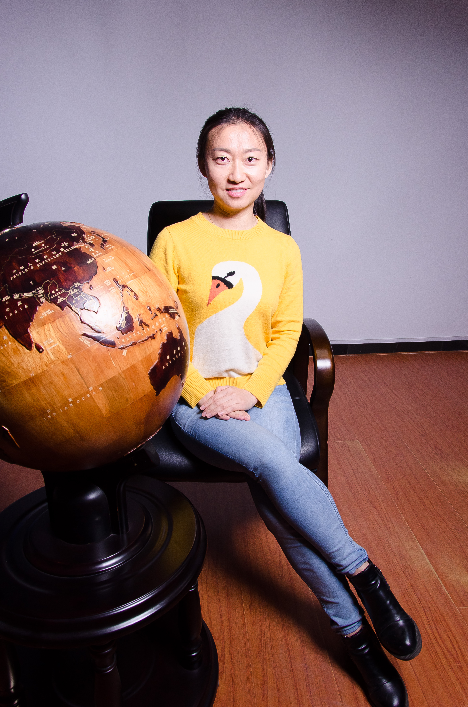
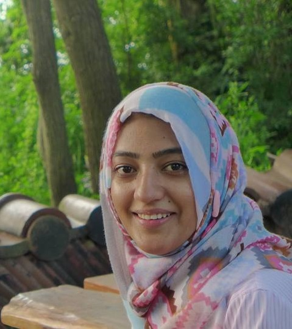
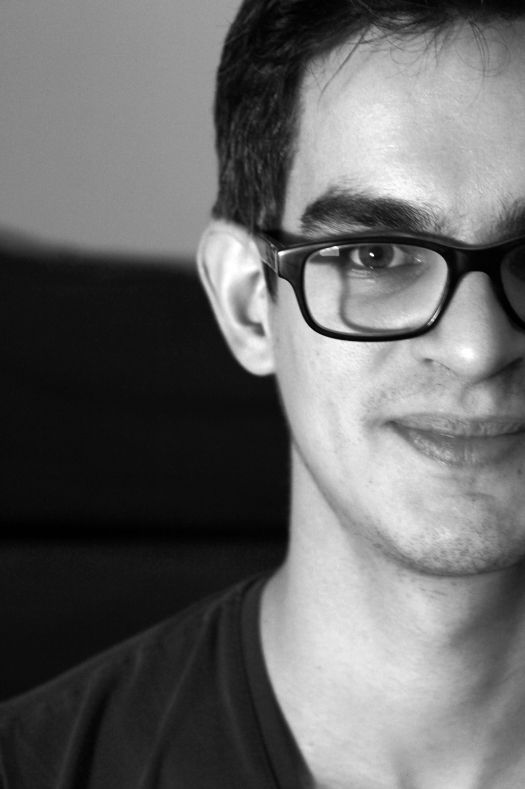
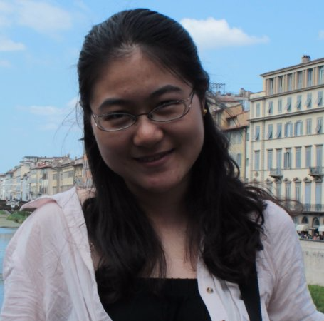
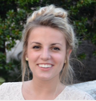

# Universiteit Van Amsterdam Inclusive AI

## UVA Inclusive AI invites Shakir Mohamed
We invite everybody that is studying, teaching, and researching AI at the University of Amsterdam to join a virtual talk and discussion with Shakir Mohamed (Google DeepMind) on Decolonial AI and Sociotechnical Foresight.

The talk and discussion will take place on the 26th of October 2020, 15:00, via Zoom [link](https://uva-live.zoom.us/j/89025891407)

In order to avoid Zoombombing, you need a UVA email address to participate.

We chose to use the webinar format. After and during the talk participants can enter questions via the chat and vote on questions. We will then enable the video and audio of the person that authored the question. Please consider reading his latest work before the talk:

[Decolonial AI: Decolonial Theory as Sociotechnical Foresight in Artificial Intelligence](https://arxiv.org/abs/2007.04068)

CALL FOR QUESTIONS

In addition, we encourage everybody to prepare and submit questions for Shakir to info.uva.iai@gmail.com during the next week. 

## Statement on UVA IAI

The UvA Instituut voor Informatica is the proud home of an Inclusive AI (IAI) community for the Master's programme AI. The IAI is an inclusive space for members to get non-academic help from senior peers in the field and connect with like-minded people of a similar background. Our goal is to directly combat the infamous leaky pipeline found in academia.

## Code of Conduct
1. Privacy is important to us. Do not share details about others that they have not explicitly made public. This includes, but is not limited to, sexuality, gender, medical conditions, housing, relationships or financial status.
2. Aggression and elitism are unwelcome - knowledge is not a competition. After all you are here to support each other, so do that whenever you can.
3. Do not engage in homophobic, racist, transphobic, ableist, sexist, or otherwise exclusionary behaviour. Do not make jokes related to these either. Use people’s preferred pronouns (don't be afraid to ask).
4. Harassment will not be tolerated in any form. Under no circumstances should a mentor be romantically involved with their mentee. Should romantic feelings develop nonetheless, we will reassign mentor and mentee.
5. We take collective responsibility for making all members feel welcome and agree to act accordingly.

## Mentorship
We currently offer a mentorship scheme for students of the UvA AI masters program. 

Mentees should expect to be able to:

- ask their mentor for practical advice, e.g. how to write a CV or motivation letter, where to apply for jobs, when to apply for PhDs
- network with other students
- seek non-academic advice from their mentor
- learn how to present their research
- connect with other researchers

Mentees are expected to:

- Adhere to the UvA-IAI code of conduct

We have taken inspiration from organisations such as Black in AI, Women in ML, Queer in AI, Latinx in ML, and Jews in ML, which all aim to celebrate diversity and foster participation from underrepresented groups in AI. The IAI establishes a similar space for students of AI Master at the UvA.

[APPLY HERE](https://goo.gl/forms/gOVvs3N39VkRwimu2)

## Becoming a Mentor
If you want to become a mentor yourself [APPLY HERE](https://forms.gle/mqzsrREZBUtpQPxg7).

## List of Mentors
### Daniel Worrall

I am a postdoc in Max Welling’s new Philips group at the UvA. I did my PhD at UCL in the Machine Vision Group. Before that I studied engineering at The University of Cambridge, and am a scholar of Sidney Sussex College. I am currently lecturing Probability Theory for Machine Learning, and am the lab manager for the Philips lab at the UvA.

My research focuses on generalizing convolution, approximate Bayesian inference, optimization, uncertainty quantification, and medical imaging.

### Marco Federici

I am a Ph.D. student in the AMLab group, supervised by Dr. Zeynep Akata and prof Max Welling in collaboration with Microsoft Research Cambridge.
I studied computer science at the University of Trento and completed a master degree in Artificial Intelligence at the University of Amsterdam.
My research involves multimodal, zero-shot and unsupervised learning for text and visual sources, with a focus on information theory, Bayesian inference, and deep learning.

### Elise van der Pol

I am a PhD student in Deltalab, supervised by Max Welling &#38; Frans Oliehoek (TU Delft). Before starting my PhD, I studied Artificial Intelligence at University of Amsterdam. 

My main research interests are reinforcement learning, multi-agent coordination and meta-RL, but I am also interested in deep learning and generative modeling, especially for use in planning &#38; learning for control.

### Rianne van den Berg

I am a postdoctoral researcher in machine learning at the University of Amsterdam under the supervision of Prof. Max Welling. My main research interest is deep generative modeling from a probabilistic point of view. In particular, I work on variational inference, normalizing flows and generative adversarial networks. Recently, I also became interested in deep learning for dynamical systems described by differential equations. I am also interested in deep learning for graph-based data.

<!--

### Rodolfo (Rudy) Corona

I am a visiting researcher working with Dr. Zeynep Akata under the support of a Fulbright grant. I recently completed my bachelors degree at the University of Texas at Austin and will start a PhD at UC Berkeley after my grant ends in June 2019. I work at the intersection of natural language processing and computer vision, and am interested in language grounding, semantics, and theory of mind.
-->

### Pascal Mettes

I am a postdoctoral researcher at the University of Amsterdam under the supervision of prof. Cees Snoek. My primary research topic is the recognition and spatio-temporal localization of actions in videos. My research interests also include deep learning and representation learning.

### Karen Ullrich

I am a Ph.D. student at Uo Amsterdam, supervised by Prof. Max Welling and alumna of the Austrian Research Institute for AI, Intelligent Music Processing and Machine Learning Group lead by Prof. Gerhard Widmer.
My research focus lies in machine learning. I am interested in statistical inference, information theory, deep learning, Bayesian methods, geometric methods and graph theory. I apply techniques of the aforementioned to problems in structural and systems biology, compression, sequential data (e.g. music, environmental data) and real-time sensoring.

### Maximilian Ilse

I recently joint the Amsterdam Machine Learning Lab led by Max Welling as a PhD candidate. I am working at the intersection of medical imaging and fundamental machine learning research. Here, my research focus lies on domain adaptation, semi-supervised learning and transfer learning. Prior to my PhD - during my master’s degree and previous employment - I focused on working with time series (sound, movement, temperature).

### Maartje ter Hoeve

I am a Ph.D. student at the University of Amsterdam, supervised by Prof. Maarten de Rijke and Dr. Julia Kiseleva. Before starting my PhD I completed my MSc degree in Artificial Intelligence at the University of Amsterdam. In my current work I focus on IR and NLP. I'm especially interested in how we can learn from humans / human cognition to improve our models. I am also interested in algorithmic explainability.

### Dan Li

I am a Ph.D. candidate in ILPS, supervised by Prof. Evangelos Kanoulas and Prof. Maarten de Rijke. I work on Interactive Information Retrieval and its Evaluation, as well as Conversational Search. My research interests also involve Deep Learning and Gaussian Processes.
Before starting my PhD, I worked on the Collocation Extraction task and completed my masters degree at the Dalian University of Technology in China.

### Sadaf Gulshad

I am a Ph.D. researcher at UvA Bosch Delta Lab supervised by Arnold Smeulders and Zeynep Akata. I am working on explainable aritifical intelligence and on making classifiers robust especially when confronted with adversarial examples. Before moving to Amsterdam I did my master's in Electrical Engineering from KAIST, South Korea and bachelor's from COMSATS, Pakistan. 

### Tim Bakker

I'm a PhD student in AMLab at the University of Amsterdam, working with prof. Max Welling and dr. Herke van Hoof on efficient deep learning, with a focus on active learning and uncertainty estimation. Before moving into machine learning I studied theoretical physics at the UvA, and I've previously worked as a machine learning engineer/researcher in an ML-focused consultancy startup in Amsterdam.

### Shihan Wang

I'm a postdoctoral researcher in AMLab at the University of Amsterdam, working with prof. Ben Krose and dr. Herke van Hoof on data mining and applied machine learning. Recently, I am interested in how to integrate efficient machine learning techniques in ubiquitous computing and social computing tasks. Before moving to Amsterdam, I received my degrees from Tokyo Institute of Technology, University of Edinburgh and Northeastern University (in China). 

### Ana Lucic

I’m a PhD student at the University of Amsterdam, supervised by Prof. Maarten de Rijke and Prof. Hinda Haned, working primarily on interpretable machine learning. My other research interests include algorithmic fairness, ensemble learning, and graph representation learning. Before starting my PhD, I did my BSc and MSc, both in mathematics, at McMaster University in Canada. 

## Contact
Questions, comments or ideas? We are looking forward to hearing from you!

Mail to: info.uva.iai@gmail.com
