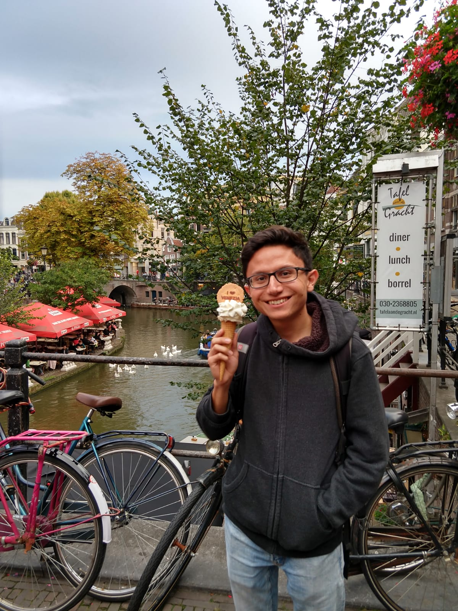
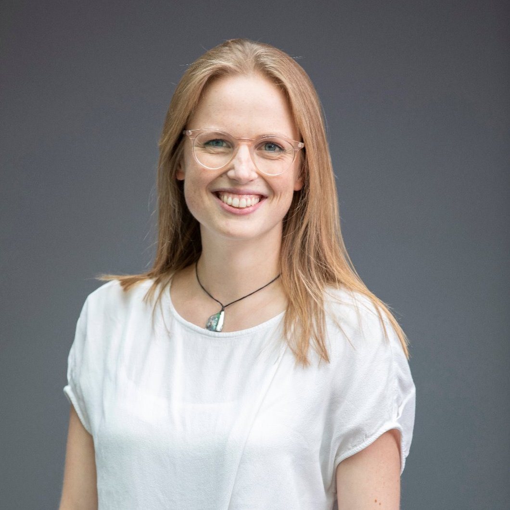

# Universiteit Van Amsterdam Inclusive AI

## Statement on UVA IAI

We are proud to announce that the UvA Instituut voor Informatica is opening a new Inclusive AI (IAI) community. The IAI is an inclusive space for members to connect with like-minded people of a similar background. Our goal is to directly combat the infamous leaky pipeline found in academia, and more broadly in the tech sector.

We have taken inspiration from organisations such as Black in AI, Women in ML, Queer in AI, Latinx in ML, and Jews in ML, which all aim to celebrate diversity and foster participation from underrepresented groups in AI. The IAI establishes a similar such space for students of the KI Bachelor and AI Master at the UvA 

## Mentorships
We currently offer a mentorship scheme for students of the UvA AI masters course. 

Mentees are likely to come from structural minorities, including but not limited to:

- female gendered and gender minorities, 
- racial and ethnic minorities, 
- economically disadvantaged minorities, 
- the LGBTQ+ community, 
- disabled people.

Mentees should expect to be able to:

- ask their mentor for practical advice, e.g. how to write a CV or motivation letter, where to apply for jobs, when to apply for PhDs
- network with other students
- seek pastoral advice from their mentor
- learn how to present their research
- connect with other researchers

[APPLY HERE](https://goo.gl/forms/gOVvs3N39VkRwimu2)

## List of mentors
### Karen Ullrich

I am a Ph.D. student at Uo Amsterdam, supervised by Prof. Max Welling and alumna of the Austrian Research Institute for AI, Intelligent Music Processing and Machine Learning Group lead by Prof. Gerhard Widmer.
My research focus lies in machine learning. I am interested in statistical inference, information theory, deep learning, Bayesian methods, geometric methods and graph theory. I apply techniques of the aforementioned to problems in structural and systems biology, compression, sequential data (e.g. music, environmental data) and real-time sensoring.

### Daniel Worrall

I am a postdoc in Max Welling’s new Philips group at the UvA. I did my PhD at UCL in the Machine Vision Group. Before that I studied engineering at The University of Cambridge, and am a scholar of Sidney Sussex College. I am currently lecturing Probability Theory for Machine Learning, and am the lab manager for the Philips lab at the UvA.

My research focuses on generalizing convolution, approximate Bayesian inference, optimization, uncertainty quantification, and medical imaging.

### Marco Federici

I am a Ph.D. student in the AMLab group, supervised by Dr. Zeynep Akata and prof Max Welling in collaboration with Microsoft Research Cambridge.
I studied computer science at the University of Trento and completed a master degree in Artificial Intelligence at the University of Amsterdam.
My research involves multimodal, zero-shot and unsupervised learning for text and visual sources, with a focus on information theory, Bayesian inference, and deep learning.

### Elise van der Pol

I am a PhD student in Deltalab, supervised by Max Welling &#38; Frans Oliehoek (TU Delft). Before starting my PhD, I studied Artificial Intelligence at University of Amsterdam. 

My main research interests are reinforcement learning, multi-agent coordination and meta-RL, but I am also interested in deep learning and generative modeling, especially for use in planning &#38; learning for control.

### Rianne van den Berg

I am a postdoctoral researcher in machine learning at the University of Amsterdam under the supervision of Prof. Max Welling. My main research interest is deep generative modeling from a probabilistic point of view. In particular, I work on variational inference, normalizing flows and generative adversarial networks. Recently, I also became interested in deep learning for dynamical systems described by differential equations. I am also interested in deep learning for graph-based data.

### Rodolfo (Rudy) Corona

I am a visiting researcher working with Dr. Zeynep Akata under the support of a Fulbright grant. I recently completed my bachelors degree at the University of Texas at Austin and will start a PhD at UC Berkeley after my grant ends in June 2019. I work at the intersection of natural language processing and computer vision, and am interested in language grounding, semantics, and theory of mind.

### Pascal Mettes

  
  
I am a postdoctoral researcher at the University of Amsterdam under the supervision of prof. Cees Snoek. My primary research topic is the recognition and spatio-temporal localization of actions in videos. My research interests also include deep learning and representation learning.

### Maximilian Ilse

I recently joint the Amsterdam Machine Learning Lab led by Max Welling as a PhD candidate. I am working at the intersection of medical imaging and fundamental machine learning research. Here, my research focus lies on domain adaptation, semi-supervised learning and transfer learning. Prior to my PhD - during my master’s degree and previous employment - I focused on working with time series (sound, movement, temperature).

### Maartje ter Hoeve

I am a Ph.D. student at the University of Amsterdam, supervised by Prof. Maarten de Rijke and Dr. Zeynep Akata. Before starting my PhD I completed my MSc degree in Artificial Intelligence at the University of Amsterdam. Now I work on multi-modal machine learning, with summarisation as main task. I am also interested in algorithmic explainability and reasoning. 

## Contact
Questions, comment or want to become a mentor yourself? We are looking forward to hearing from you!

Mail to: info.uva.iai@gmail.com
